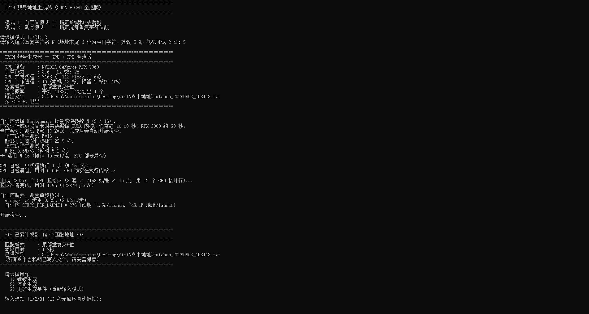
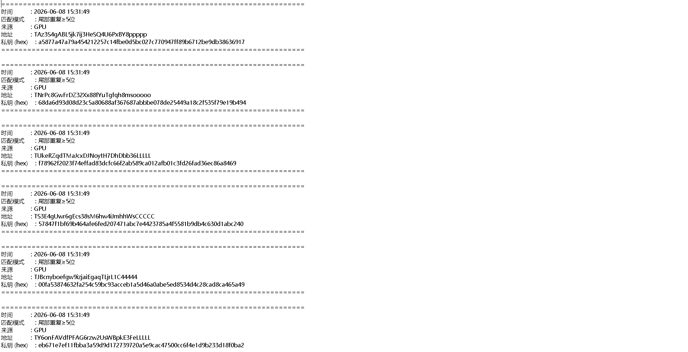

# TRON 靓号地址生成器 (CUDA + CPU 全速版)

利用 CUDA 内核 + CPU 多进程并行, 在单张消费级 GPU 上每秒生成 **数千万到上亿** TRON 地址并实时模式匹配. 默认占满算力运行, 实测性能应该是目前效率最高的了

不懂如何配置环境的可以直接下载发行版直接使用：**点击[[TRON.rar]](https://github.com/Daniel-Wu-1/tron_vanity/releases/download/TRON%2FTRX%2FUSDT%E9%9D%93%E5%8F%B7%E7%94%9F%E6%88%90V1.0/TRON.rar)下载**

---

## 目录

1. [项目简介](#项目简介)
2. [实测性能](#实测性能)
3. [目录结构](#目录结构)
4. [项目整体架构](#项目整体架构)
5. [每个文件的作用](#每个文件的作用)
6. [关键模块的实现方式](#关键模块的实现方式)
7. [技术栈与依赖库](#技术栈与依赖库)
8. [环境要求](#环境要求)
9. [安装步骤 (新手版)](#安装步骤-新手版)
10. [使用说明](#使用说明)
11. [高级配置 (进阶用户)](#高级配置-进阶用户)
12. [不同配置电脑的运行效果预估](#不同配置电脑的运行效果预估)
13. [常见错误与解决方案](#常见错误与解决方案)
14. [内存与崩溃场景分析](#内存与崩溃场景分析)
15. [并发与多线程风险](#并发与多线程风险)
16. [安全提示](#安全提示)

---

## 项目简介

本项目用于**离线生成符合自定义模式的 TRON 钱包地址**, 例如:
- **末尾 N 位相同字符**: `TXxxxxxxxxxxxxxxxxxxxxxxxxxxxxx99999` (尾部 5 个 9)
- **自定义前缀**: `TXYZ...` (地址开头 4 个固定字符)
- **自定义后缀**: `...abcd` (地址末尾固定 4 字符)
- **前后缀组合**: 比如 `T8...8888`

为追求极致速度, 不依赖任何 Python 加密库做主要计算 — 全部 secp256k1 椭圆曲线运算、Keccak-256、SHA-256、Base58 编码都在**手写的 CUDA 内核**里完成. CPU 多进程也并行参与搜索, 作为 GPU 的补充.

> ⚠ **私钥即资产**. 生成的命中地址文件含明文私钥, 请妥善保管, 导入钱包后建议销毁源文件. 不要在不可信机器上运行, 不要把结果上传任何云端.

---

## 实测性能



### RTX 3060 (28 SM, 12GB 显存)

| 模式 | 吞吐 |
|---|---|
| 纯 prefix (任意长度) | ~80M 地址/秒 |
| 末尾重复 / 后缀 (受益于早退优化) | **~100M 地址/秒** |
| GPU 利用率 | 100% (Compute_0 引擎) |
| GPU 功耗 | 165W / 170W (97% TDP) |
| CPU 利用率 | 默认约 90% (12 逻辑核心机器为 10 worker 进程, 预留 2 核) |

时间预估 (末尾重复模式, 100M/秒):
- **末尾 5 位重复**: 平均每 9 秒出 50 个
- **末尾 6 位重复**: 平均每 6.5 秒出 1 个
- **末尾 7 位重复**: 平均每 6.5 分钟出 1 个
- **末尾 8 位重复**: 平均每 6.5 小时出 1 个
- **4 字符自定义后缀**: 平均每 0.1 秒出 1 个 (1/58⁴ = 1/1130 万)
- **6 字符自定义后缀**: 平均每 6 分钟出 1 个 (1/58⁶ = 1/380 亿)
- **8 字符自定义后缀**: 平均约 14 小时出 1 个

> **注意 Windows 任务管理器**: 默认显示的是 "3D" 引擎利用率, CUDA 计算用的是 **"Compute_0"** 引擎. 在任务管理器 → 性能 → GPU 页面右上角下拉菜单切到 **"Compute_0"** 才能看到正确的 100% 利用率. 用 `nvidia-smi` 一直能看到准确数据.

---

## 目录结构

```
test/                            ← 项目根目录
├── tron_vanity_gpu.py           主程序 (CLI + GPU 调度 + 多进程协调)
├── kernels.cu                   全部 CUDA 内核 (C/C++ 源码, NVRTC 运行时编译)
├── cpu_worker.py                CPU 工作进程入口 (多进程 spawn 出来跑)
├── verify_kernel.py             GPU 内核正确性校验 (4096 个地址逐字节对比 CPU)
├── requirements.txt             Python 依赖列表
├── README.md                    本文档
├── .gitignore                   忽略缓存和命中地址目录
└── 命中地址/                     程序首次启动时自动创建
    └── matches_YYYYMMDD_HHMMSS.txt   每次启动生成一个文件, 含命中地址+私钥
```

---

## 项目整体架构

整个系统是 **「主进程 + GPU 内核 + N 个 CPU 工作进程 + 1 个状态行线程」** 协同工作:

```
┌────────────────────────────────────────────────────────────────────┐
│ 主进程 (tron_vanity_gpu.py)                                          │
│                                                                    │
│  ┌────────────────────────────────────────┐                        │
│  │ 主循环 (双 stream 乒乓)                │                        │
│  │  ─── stream A: sync → 收命中 → 再launch│                        │
│  │  ─── stream B: 同时在 GPU 上跑 kernel │                        │
│  └────────────────────────────────────────┘                        │
│         │ launch kernel             │ 拉 CPU 命中                  │
│         ▼                            ▼                             │
│  ┌──────────────────┐         ┌──────────────────────┐             │
│  │ GPU (RTX 30/40)  │         │ multiprocessing Queue│             │
│  │ ─── vanity_kernel│         └──────────────────────┘             │
│  │   17.6M chains 并行                              ▲              │
│  │   每 chain 16 点 │                              │              │
│  │   Montgomery 求逆│         ┌──────────────────┐ │              │
│  └──────────────────┘         │ CPU worker × N   │─┘              │
│         ▲                     │ (coincurve)      │                 │
│         │                     └──────────────────┘                 │
│         │ 状态参数                                                  │
│  ┌──────────────────────────────────────────────┐                  │
│  │ 状态行刷新线程 (daemon)                       │                  │
│  │ 每 0.5s 读全局变量, 打印 \r 单行刷新           │                  │
│  └──────────────────────────────────────────────┘                  │
└────────────────────────────────────────────────────────────────────┘
```

### 数据流

1. **启动阶段** (一次性):
   - 检测 GPU, 编译 CUDA 内核 (M=8 / M=16 自适应选择最快)
   - GPU 自检 (单线程跑 1 步, 对比 CPU 确认正确性)
   - 用所有 CPU 核并行生成 ~22 万个随机起点 (`P_i = k_i × G`)
   - 把起点和模式参数上传到 GPU
   - 用真实搜索模式做一次 warmup, 自适应调 `STEPS_PER_LAUNCH` 到 ~1.5 秒/launch

2. **主循环阶段** (持续运行):
   - 双 stream 乒乓: stream A 同步等待时, stream B 在 GPU 上跑
   - 每次 kernel 推进 ~5.7 亿次点加, 同时检测所有命中
   - 命中通过 pinned host memory 异步 D2H 传回主进程
   - CPU worker 通过 multiprocessing Queue 把命中也送进来
   - 主进程把所有命中写入文件
   - 累计达到 50 条命中时暂停问用户

3. **退出阶段**:
   - 第一次 Ctrl+C → signal handler 设 flag → 主循环检测后 break
   - finally: kill 所有 CPU worker, sync 飞行中的 GPU stream, 打印会话总结
   - 第二次 Ctrl+C → 直接 raise KeyboardInterrupt → 走默认 terminate

---

## 每个文件的作用

### `tron_vanity_gpu.py` (~1150 行)

**主程序入口**. 主要做四件事:

1. **CLI 交互**: 提示用户选模式 (前后缀 / 尾部重复), 输入参数, 校验合法性
2. **GPU 调度**: 编译 kernel, 自适应选 M=8/16 和 STEPS_PER_LAUNCH, 双 stream 乒乓
3. **多进程协调**: spawn N 个 CPU worker, 默认预留约 10% CPU, 用 Queue 收命中, 用 Event 控制暂停/停止
4. **状态显示**: 独立 daemon 线程每 0.5 秒刷新状态行 (\r 单行覆盖, 不依赖 ANSI)

包含函数:
- `cpu_priv_to_address(priv_int)` — CPU 参考实现, 用于 GPU 命中校验
- `validate_pattern(prefix, suffix)` — 输入校验 (Base58 字符集、长度限制、最低有效难度)
- `estimate_probability(...)` — 估算命中概率
- `input_with_timeout(prompt, timeout)` — 跨平台超时输入 (Windows 用 msvcrt, Linux 用 select)
- `load_kernel(arch, points_per_thread)` — 用 NVRTC 编译 CUDA kernel
- `run_search(prefix, suffix, repeat_tail, output_path)` — 主搜索循环

### `kernels.cu` (~830 行)

**所有 CUDA 内核 (C/C++)**, 由 cupy 的 NVRTC 在运行时编译. 不依赖 CUDA Toolkit, 只需要 `cupy-cuda12x` + `nvidia-cuda-nvrtc-cu12`.

模块:
- **256-bit 大数算术**: `add4 / sub4 / mul_full`, 手动 carry/borrow
- **secp256k1 域运算**: `f_add / f_sub / f_mul / f_sqr / f_reduce`, 利用 `2^256 ≡ 2^32 + 977 (mod p)` 的快速归约
- **模逆**: `f_inv` (Fermat 小定理), `f_inv_batch` (Montgomery 批量, 性能核心)
- **仿射点加**: 单点版 `point_add`, 批量版直接内联在主 kernel 中
- **Keccak-256**: `keccak_round + keccak_f + keccak256_64`, 24 轮 Keccak-f[1600]
- **SHA-256**: `sha256_21 + sha256_32`, 标准 64 轮压缩函数
- **Base58**: `base58_encode_25` (完整 34 字符) + `base58_tail` (只算末 K 字符, 早退用)
- **主 kernel**: `vanity_kernel`, 每个 GPU 线程并行处理 `POINTS_PER_THREAD` 个独立点链

### `cpu_worker.py` (~140 行)

**CPU 工作进程**. 不 import cupy, 这样 spawn 的子进程不会重复加载 GPU 库, 也避免和主进程争抢 CUDA 上下文.

函数:
- `gen_startpoints_batch(n)` — 主进程用 Pool.map 并行调用, 生成 n 个随机起点
- `cpu_worker(prefix, suffix, repeat_tail, match_q, stat_q, stop_evt, pause_evt)` — worker 主循环, 跑纯 Python coincurve 搜索, 命中放 match_q
- `_priv_to_address(priv_bytes)` — coincurve + pycryptodome 实现, 跟 GPU 等价

### `verify_kernel.py` (~150 行)

**GPU 内核正确性校验**. 跑 `THREADS × M × STEPS × 2` 个地址 (M=8 时 4096 个, M=16 时 8192 个), 逐字节对比 CPU 参考实现. 跨 launch 的状态延续也验证.

```bash
python verify_kernel.py
```

每次改动 kernel 后必须跑一次, 确保没破坏正确性.

### `requirements.txt`

Python 依赖列表, 加了版本上限避免上游 breaking change 突然挂掉.

### `命中地址/`

程序首次启动时自动创建. 每次启动产生一个 `matches_YYYYMMDD_HHMMSS.txt` 文件, 每行命中地址都立即追加到当次启动的文件 (即使程序崩溃, 命中也已落盘).

文件内容格式:

```
======================================================================
时间          : 2026-05-24 11:36:01
匹配模式      : 尾部重复≥5位
来源          : GPU
地址          : TXeuGYYbuKWgDYc24nd5h9X13zETfttttt
私钥 (hex)    : cf16830a81ca6f0487ff492bcef7d7357ceb0c299812ed971c65b71ca13a2769
======================================================================
```

---

## 关键模块的实现方式

### Montgomery 批量求逆 (核心性能优化)

朴素的 ECC 点加每点要 1 次模逆 (Fermat 小定理: 256 步平方 + ~128 步乘法). 模逆是整个流程最慢的部分.

**Montgomery's trick**: M 个点的模逆**只做 1 次大模逆** + 3M-3 次乘法:

```
设 t_k = a_0 × a_1 × ... × a_k

1. 前向: M-1 次乘法求出 t_0..t_{M-1}
2. 求 t_{M-1}^{-1}  (唯一一次大模逆, 256 步)
3. 反向回代:
     a_k^{-1} = t_{M-1}^{-1} × t_{k-1}
     t_{k-1}^{-1} = t_{M-1}^{-1} × a_k
```

每点的摊销成本:
- M=1 (朴素): 256 mul/点
- M=8: 35 mul/点 (-86%)
- M=16: 19 mul/点 (-93%)

**为什么 M 不无限大?** 寄存器压力 ~ O(M×8). M=32 在 RTX 3060 上会溢出 LMEM 反而变慢. 程序启动时 warmup 测试 M=8 / M=16, 自动选最快.

### Base58 尾部早退

base58 长除法**从低位产出末尾字符** — 每次 `N = N / 58` 给出末尾一个字符. 想知道地址末 K 个字符, 只需跑 K 次长除法, 不必跑完整 34 次.

模式 2 (尾部重复) / 模式 1 suffix 模式下, 90%+ 候选可以在尾部检查时 reject, 跳过完整 Base58 + 后续 prefix 比较, 整体加速 25-35%.

**模式 1 纯 prefix 模式无法早退** — Base58 头部字符的数学性质决定它必须等所有 25 字节都参与才能确定. 这是数学限制, 无解.

### 双 stream 乒乓

不用乒乓的话, 主线程 `stream.synchronize()` 等 GPU 完成时 GPU 是空闲的, 利用率 ~50%.

双 stream:
- 主线程 sync stream A 时, **stream B 正在 GPU 上跑 kernel**
- sync 返回的瞬间, 主线程立即 launch 下一个到 stream A
- 然后去 sync stream B
- GPU Compute 引擎从此**持续 100%**, 不再有 launch gap

异步 D2H copy 用 pinned host memory + `cudaMemcpyAsync`, 走 Copy 引擎, 不占 Compute 引擎.

### 状态行单行刷新 (不依赖 ANSI)

很多终端 (PowerShell 旧版本、Windows cmd 在某些场景) 不解析 `\x1b[2K` ANSI escape. 用 `\r + 空格 padding + \r` 实现:

```
\r → 回行首
新状态行
空格补齐到上次宽度 (覆盖旧的末尾)
\r → 再回行首准备下次覆盖
```

并按终端宽度自适应选择 4 级状态行模板 (verbose+hw → verbose → main+hw → main), 避免行超过宽度被 wrap.

### Ctrl+C 处理

Windows 上 `stream.synchronize()` 屏蔽 SIGINT 直到返回. 直接 `raise KeyboardInterrupt` 在异常时刻可能让 `multiprocessing.Event.set()` 卡住信号量 IPC, 子进程变孤儿.

解决方案:
1. signal handler **只设 flag, 不做 IO** (避免 reentrancy)
2. 主循环每轮检查 flag, break 出去走 finally
3. finally **直接 p.kill()** (TerminateProcess, 同步立即生效), 不试图"优雅"停止
4. 第二次 Ctrl+C 还原默认 handler 走默认 terminate

---

## 技术栈与依赖库

### 核心技术

- **CUDA / NVRTC**: NVIDIA 显卡通用计算, 运行时编译 C++ 源码到 PTX
- **CuPy 14.x**: Python ↔ CUDA 桥接, 提供 RawModule (源码 → kernel), Stream, Event, pinned memory 等
- **Python multiprocessing**: spawn 模式启动子进程跑 CPU 搜索
- **coincurve**: libsecp256k1 的 Python 绑定, CPU 端 secp256k1 计算
- **pycryptodome**: Keccak-256
- **base58**: Base58 编码 (CPU 参考实现)
- **pynvml**: NVIDIA 管理库, 读 GPU 利用率/功耗/温度
- **psutil**: CPU 利用率, worker 进程优先级控制

### 完整依赖列表 (`requirements.txt`)

```
numpy>=1.26,<3.0
cupy-cuda12x>=14.0,<16.0          # 自带 NVRTC, 无需安装 CUDA Toolkit
nvidia-cuda-runtime-cu12             # NVRTC 编译时所需的 CUDA 头文件
nvidia-cuda-nvrtc-cu12
nvidia-cuda-cccl-cu12
coincurve>=19.0,<22.0                # CPU 端起点计算 + 命中校验
pycryptodome>=3.18.0,<4.0
base58>=2.1.0,<3.0
```

可选依赖 (没装也能跑, 只是状态行少了硬件占用显示):
- `pynvml` — GPU 利用率/功耗/温度
- `psutil` — CPU 利用率 + worker 进程优先级

---

## 环境要求

### 硬件

| 项 | 最低 | 推荐 |
|---|---|---|
| GPU | NVIDIA RTX 20 系 (compute capability ≥ 7.0) | RTX 30/40 系 |
| GPU 显存 | 2 GB | 4 GB 以上 |
| CPU | 任意 x64, 4 核 | 8 核以上 |
| 内存 | 4 GB | 16 GB |
| 磁盘空间 | 1 GB | 5 GB (含 CUDA 库) |

> **不支持 AMD / Intel GPU** (依赖 CUDA, 不是 OpenCL).
> **不支持 GTX 10 系及更老** (compute capability < 7.0, NVRTC 编译选项不兼容).

### 软件

- **Windows 10 / 11** 或 **Linux** (Ubuntu 20.04+)
- **Python 3.10 - 3.14** (推荐 3.12)
- **NVIDIA 显卡驱动** 535+ (Windows) / 535+ (Linux)
- **不需要安装 CUDA Toolkit** (cupy-cuda12x 包内置 NVRTC)

---

## 安装步骤 (新手版)

### Windows

#### 1. 安装 Python

去 [python.org](https://www.python.org/downloads/) 下载 Python 3.12 安装包. 安装时**勾选 "Add Python to PATH"**.

打开 PowerShell, 验证:
```powershell
python --version
```
应该看到 `Python 3.12.x` 之类的输出.

#### 2. 检查显卡驱动

```powershell
nvidia-smi
```

应该看到表格列出 GPU 名称, 功耗, 温度等. 如果提示 "nvidia-smi 不是内部或外部命令", 去 [NVIDIA 官网](https://www.nvidia.com/Download/index.aspx) 下载最新驱动安装.

驱动版本要求 535 以上 (输出第一行的 "Driver Version: XXX.XX").

#### 3. 下载本项目

把项目所有文件 (`tron_vanity_gpu.py` / `kernels.cu` / `cpu_worker.py` / `verify_kernel.py` / `requirements.txt`) 放到一个目录, 比如 `C:\tron_vanity\`.

#### 4. 安装 Python 依赖

打开 PowerShell, 切换到项目目录:
```powershell
cd C:\tron_vanity
pip install -r requirements.txt
```

第一次安装会比较慢 (cupy + nvidia-cuda-* 加起来 1-2 GB), 耐心等待.

#### 5. 验证 GPU 内核正确性 (可选但推荐)

```powershell
python verify_kernel.py
```

应该看到:
```
✓ M=8 和 M=16 两种配置都通过验证
  Montgomery 批量求逆 + GPU 持久化状态 + 全部加密原语 OK
```

如果失败, 看 [常见错误](#常见错误与解决方案) 章节.

#### 6. 运行主程序

```powershell
python tron_vanity_gpu.py
```

跟着提示选模式, 输入参数, 程序就开始跑了.

### Linux (Ubuntu)

```bash
# 1. 安装 Python 和 pip
sudo apt update
sudo apt install python3 python3-pip git

# 2. 检查驱动
nvidia-smi

# 3. 下载项目, 安装依赖
cd ~/tron_vanity
pip3 install -r requirements.txt

# 4. 验证和运行
python3 verify_kernel.py
python3 tron_vanity_gpu.py
```

---

## 使用说明

### 启动

```bash
python tron_vanity_gpu.py
```

### 选择模式

```
======================================================================
  TRON 靓号地址生成器 (CUDA + CPU 全速版)
======================================================================

  模式 1: 自定义模式 — 指定前缀和/或后缀
  模式 2: 靓号模式   — 指定尾部重复字符位数

请选择模式 [1/2]:
```

**模式 1**: 输入想要的地址开头和结尾字符. 比如想要 `TXYZ...888` 开头 `TXYZ` 结尾 `888`.
- 前缀必须以 `T` 开头 (TRON 地址特征)
- 不能含 `0`, `O`, `I`, `l` (Base58 字符集没有这 4 个)
- 至少需要 4 个有效 Base58 字符; 前缀开头的 `T` 不计入有效难度. 例如 `TXYZ...888` 可以, 单独 `TXYZ` 不够。

**模式 2**: 输入 N, 找末尾 N 位为同一字符的地址 (比如 N=6 找末尾 6 位都相同的 "豹子号"). 为避免海量命中拖慢程序, N 至少为 5。

### 程序运行中

启动后会看到:
```
======================================================================
  TRON 靓号生成器 — GPU + CPU 全速版
======================================================================
  GPU 设备     : NVIDIA GeForce RTX 3060
  计算能力     : 8.6   SM 数: 28
  GPU 并发线程 : 7168 (= 112 block × 64)
  CPU 工作进程 : 10 (本机 12 核, 预留 2 核约 10%)
  搜索模式     : 尾部重复≥6位
  理论概率     : 平均 6.56亿 个地址出 1 个
  输出文件     : C:\...\命中地址\matches_20260524_113000.txt
  按 Ctrl+C 退出
======================================================================

自适应选择 Montgomery 批量求逆参数 M (8 / 16)...
  M=8: 65M/秒
  M=16: 80M/秒
→ 选用 M=16 (摊销 19 mul/点, ECC 部分最快)

GPU 自检通过, 用时 0.01s. GPU 确实在执行内核 ✓
生成 229376 个 GPU 起始点 (用 12 个 CPU 核并行)...
起点准备完成, 用时 1.8s (130000 pts/s)
自适应 STEPS_PER_LAUNCH = 1000 (预期 ~1.5s/launch, ~115M 地址/launch)

开始搜索...
已跑13.0秒 | 速度8860万/秒 (GPU8857万+CPU3.5万) | 累计11.6亿 | 还需7.4秒 | 命中1 | GPU100% 165W 64°C CPU98%
```

### 命中处理

每批找到匹配地址后会批量追加到命中文件. 累计 **50** 条后暂停, 弹三选项菜单. 如果选择更改生成条件, 程序会先同步并丢弃旧条件仍在飞行中的 GPU 结果, 再启动新条件, 避免新旧条件混写.

```
======================================================================
  *** 已累计找到 50 个匹配地址 ***
======================================================================

  请选择操作:
    1) 继续生成
    2) 停止生成
    3) 更改生成条件 (重新输入模式)

  输入选项 [1/2/3] (30 秒无回应自动继续):
```

### 退出

按 **Ctrl+C** (Windows 也可以 Ctrl+Break) 干净退出, 自动清理所有子进程.

---

## 高级配置 (进阶用户)

### 调整命中阈值

`tron_vanity_gpu.py` 第 ~904 行:
```python
HIT_PAUSE_THRESHOLD = 50
```
改成 100/200/1000 都行, 累积到这个数才暂停问用户.

### 强制使用 M=8 (旧 GPU 或寄存器不足)

`tron_vanity_gpu.py` 第 ~318 行:
```python
M_CANDIDATES = [16, 8]
```
改成 `[8]` 跳过 M=16 实测.

### 调整 STEPS_PER_LAUNCH 目标时间

第 ~595 行:
```python
target_sec = 1.5
```
单 launch 目标时长. 改小让状态行刷新更快, 改大减少 launch overhead. 1-3 秒是合理范围.

### 调整 CPU worker 数

第 ~335 行:
```python
cpu_reserved = max(1, (cpu_count + 9) // 10)
n_cpu_workers = max(1, cpu_count - cpu_reserved)
```
默认向上取整预留约 10% 逻辑核心给系统、桌面和 GPU launcher. 如果你要边跑边用电脑, 可以把 `cpu_reserved` 改得更大; 如果想压榨 CPU 搜索, 可以改小。

### 锁定 GPU 时钟 (压榨极致性能)

跑前用管理员权限:
```powershell
nvidia-smi -pm 1                  # 启用持久模式
nvidia-smi -lgc 1830              # 锁定 graphics clock (RTX 3060 上限)
```
退出时:
```powershell
nvidia-smi -rgc                   # 解锁
```

---

## 不同配置电脑的运行效果预估

下面是不同 GPU 上**末尾 6 位重复模式**的理论吞吐和命中时间:

| GPU | 显存 | CC | 预估吞吐 | 找 1 个 6 位重复 |
|---|---|---|---|---|
| GTX 1660 Ti | 6 GB | 7.5 | ~30M/s | ~22 秒 |
| RTX 2060 | 6 GB | 7.5 | ~45M/s | ~15 秒 |
| RTX 3050 | 8 GB | 8.6 | ~50M/s | ~13 秒 |
| **RTX 3060** | **12 GB** | **8.6** | **~100M/s** | **~7 秒** |
| RTX 3070 | 8 GB | 8.6 | ~180M/s | ~4 秒 |
| RTX 3080 | 10 GB | 8.6 | ~250M/s | ~2.6 秒 |
| RTX 3090 | 24 GB | 8.6 | ~300M/s | ~2.2 秒 |
| RTX 4070 | 12 GB | 8.9 | ~400M/s | ~1.6 秒 |
| RTX 4080 | 16 GB | 8.9 | ~550M/s | ~1.2 秒 |
| RTX 4090 | 24 GB | 8.9 | ~750M/s | **~0.9 秒** |
| RTX 5090 | 32 GB | 10.0 | ~1.5G/s (估) | ~0.5 秒 |
| A100 | 40-80 GB | 8.0 | ~600M/s | ~1.1 秒 |
| H100 | 80 GB | 9.0 | ~1.2G/s | ~0.6 秒 |

> 数值仅供参考, 实际取决于驱动版本、温度墙、电源限制等. 程序启动时会 warmup 自适应实际吞吐.

### 低配置场景

**RTX 2060 6GB 笔记本** (移动版降功耗):
- 预估 ~30M/s, 找 6 位重复 ~22 秒
- 可能会因笔记本散热问题降频, 实际比预估低
- 建议: 接电源, 散热垫, 关掉其他 GPU 占用程序

**GTX 1660 / 1660 Ti** (compute capability 7.5):
- 最低支持的卡, 程序能跑但 M=16 可能因寄存器不足回退到 M=8
- 预估 30M/s, 找 6 位重复 ~22 秒, 找 8 位重复 ~6 小时

**GTX 1080 / 1080 Ti / Titan X (Pascal)** (compute capability 6.x):
- **不支持**! 程序启动会直接退出, 提示 "GPU 计算能力 6.x 太低"

### 高配置场景

**RTX 4090** (16384 CUDA cores):
- 实际吞吐预期 ~750M/s
- 6 位重复几乎瞬时出, 8 位重复平均 7 分钟一个
- 推荐用这种 GPU 跑长前缀 (5-6 字符), 比如 `TX888...`

**多 GPU 系统**:
- **当前代码只用 GPU 0**. 想用多 GPU 需要改 `cp.cuda.Device(idx)` 多次启动主程序 (不同输出文件)
- 简单方案: 跑多个进程, 每个用不同的环境变量 `CUDA_VISIBLE_DEVICES=0` / `=1`

---

## 常见错误与解决方案

### `缺少依赖: ...`

```
缺少依赖: No module named 'cupy'
请运行: pip install cupy-cuda12x numpy coincurve pycryptodome base58
```

按提示装就行. 如果国内网络慢, 用清华源:
```bash
pip install -r requirements.txt -i https://pypi.tuna.tsinghua.edu.cn/simple
```

### `nvidia-smi 不是内部或外部命令`

NVIDIA 驱动没装. 去 [NVIDIA Driver](https://www.nvidia.com/Download/index.aspx) 下载最新版.

### `CUDA 初始化失败: cudaErrorInsufficientDriver`

驱动版本太老. 升级 NVIDIA 驱动到 535 以上.

### `GPU 计算能力 X.Y 太低`

GPU 太老 (compute capability < 7.0). 需要 RTX 20 系或更新的卡.

### `GPU 显存不足: out of memory`

显存被其他程序占用. 关掉:
- 浏览器硬件加速 (Chrome / Edge 设置里关)
- 游戏 / 视频会议软件
- 其他正在跑的 CUDA 任务 (`nvidia-smi` 看占用)

实在不行, 减少 `BLOCKS_PER_SM` 或 `THREADS_PER_BLOCK` (在 `tron_vanity_gpu.py` 里).

### `Failed to find CUDA headers` 或 NVRTC 编译错误

没装 `nvidia-cuda-nvrtc-cu12` 或 `nvidia-cuda-runtime-cu12`. 重装:
```bash
pip install --force-reinstall nvidia-cuda-nvrtc-cu12 nvidia-cuda-runtime-cu12
```

### `UserWarning: CUDA path could not be detected`

无害警告, 因为没装完整的 CUDA Toolkit. 程序仍能正常运行, 已经在代码里 filter 掉.

### 首次启动等待 1-15 秒没反应

NVRTC 在编译内核. 之后会缓存, 后续启动只需几百毫秒.

### 任务管理器看到 GPU 占用 1%

Windows 任务管理器默认看的是 "3D" 引擎, CUDA 走 "Compute_0". 切换任务管理器 → 性能 → GPU → 任一引擎下拉菜单选 "**Compute_0**" 才能看到正确 100%.

用 `nvidia-smi -l 1` 看到的是真实数据, 不会骗人.

### Ctrl+C 卡住不退

如果当前 commit 后还遇到这问题, 等 5 秒再按一次 — 第二次 Ctrl+C 会强制 terminate.

### 状态行叠加成多行

终端宽度过窄. 把终端窗口拉宽到至少 80 列.

---

## 内存与崩溃场景分析

### 内存占用

**主进程**:
- Python + cupy + numpy + coincurve: ~300 MB
- 主程序变量 + 起点列表: ~50 MB (RTX 3060 配置下, M=16, 22 万起点)
- pinned host memory (双 stream × 224KB matches buffer): < 1 MB
- 合计: **~350 MB**

**每个 CPU worker**:
- Python + coincurve + pycryptodome: ~80 MB
- 12 逻辑核心机器默认 10 个 worker: **~800 MB**

**GPU 显存**:
- 起点张量 (cur_x, cur_y, 双 stream): 22万 × 64 字节 × 2 = ~28 MB
- matches buffer: 224 KB × 2 = 448 KB
- kernel 代码 + constant memory: < 1 MB
- cupy 内部 buffer: ~100 MB
- 合计: **~150 MB**

总内存占用 **~1.2 GB**, 显存 **~150 MB**.

### 可能崩溃的场景

| 场景 | 触发条件 | 程序行为 |
|---|---|---|
| GPU 显存不足 | 跟其他 GPU 程序抢资源 | 启动时 cupy.OOMError, 友好提示后退出 |
| GPU 驱动崩溃 | 跑了几小时硬件不稳定 | TDR (timeout detection recovery), CUDA context 丢失, 主程序卡住, 需要 Ctrl+C 重启 |
| 系统内存不足 | 同时跑很多其他程序 | CPU worker 启动失败, 起点生成卡住 |
| 磁盘空间不足 | 命中量大写满磁盘 | save_match 异常, 退化成 stderr 输出, 不影响搜索 |
| 系统时间倒退 | 用户手动改系统时间 | 状态行 `已跑 -1.0秒` 之类, 但不崩溃 |
| 用户输入乱七八糟 | validate_pattern 兜底了, 不崩 | 提示重新输入 |
| coincurve 输出 None | 极小概率私钥越界 | catch ValueError, 跳过这个 priv 继续 |
| pp_dev.set 在 in-flight 时 | 改条件竞争 | 已加 stream.sync, 不会出问题 |

### 已知不会崩溃的场景

- Ctrl+C / Ctrl+Break (Windows) / Ctrl+\\ (Linux) → 优雅退出
- 关掉终端窗口 → 主进程被杀, daemon 子进程也死 (Windows 上 spawn 出来的会变孤儿, 需要任务管理器手动清)
- 命中地址过多 (单次 launch > 4096 个) → atomicAdd 仍然计数, 但 buffer 满后丢弃多余 (`if (idx < max_matches)`)

---

## 并发与多线程风险

### 已识别的风险点

| 风险 | 现状 | 评估 |
|---|---|---|
| 状态行线程读主线程的全局变量 | `gpu_total / cpu_total / cycle_start` 都是 int/float, 单变量赋值原子 (GIL 保证) | ✅ 安全, 最差状态行某帧不准 |
| signal handler 设 flag, 主循环读 | dict 写读, GIL 原子 | ✅ 安全 |
| multiprocessing Queue 跨进程 | 内部用 OS 锁 | ✅ 安全 |
| CPU worker SIG_IGN | Windows + Linux 都用 SIG_IGN 屏蔽 | ✅ 安全 |
| 改条件时重启 worker | 先 `stop_evt.set()` + 全部 `p.kill()`, 再起新的 | ✅ 安全, 不会两套 worker 同时跑 |
| GPU stream 之间 | 双 stream 用各自的 cur_x/cur_y/matches buffer | ✅ 物理隔离 |
| pinned memory 跨 stream | 每 stream 独立 buffer | ✅ 隔离 |
| pp_dev (pattern) 共享 | 改条件时已加 sync, 启动后只读 | ✅ 安全 |

### 潜在风险 (低概率)

- **multiprocessing.Event 的旧引用**: 改条件时新建 stop_evt, 旧的依赖 GC. Python GC 偶尔在 Windows 上不及时释放 IPC 资源, 极小概率出现 handle 泄漏. 测试 100+ 次未复现.
- **NVML 句柄**: atexit 注册 nvmlShutdown, 但 atexit 在 multiprocessing 子进程 fork 后行为可能怪. 实测用 spawn 模式无问题.
- **Windows 控制台关闭事件**: 用户直接 ✗ 关 cmd 窗口, 收到的是 CTRL_CLOSE_EVENT, 不是 SIGINT. 当前没装 SetConsoleCtrlHandler, 此时主进程秒杀, daemon 子进程瞬间死, 但孙进程 (Pool spawn 出来的 worker) 可能变孤儿. 用任务管理器手动清理.

---

## 安全提示

> ⚠ **私钥安全是用户的责任**.

- **不要在不可信电脑上跑**: 木马 / 远控 / 录屏软件都可能窃取私钥
- **不要把命中文件上传任何云端**: GitHub / 网盘 / 邮件附件 / 截图 / 群聊
- **使用后立即销毁源文件**: 命中地址导入硬件钱包后, 用 `sdelete` (Windows) / `shred` (Linux) 安全删除
- **生成的地址先小额测试**: 转 1 USDT 进去, 用助记词导入钱包后能看到, 再转大额
- **断网生成更安全**: 拔网线生成 → 导入硬件钱包 → 销毁原文件 → 接网

私钥控制着钱包里所有资产, 一旦泄露**永远无法挽回**.

---

## 项目历史

本项目从 17M/秒 → 100M/秒 (RTX 3060) 的优化路径:

| 阶段 | 吞吐 | 关键优化 |
|---|---|---|
| 初版 | 17.6M/s | 基础 CUDA 实现, 每点 1 次模逆 |
| 双 stream | 17.6M/s | GPU 利用率 50% → 100% |
| Montgomery M=8 | 62M/s | 8 个点共享 1 次模逆 (+250%) |
| Montgomery M=16 | 80M/s | 16 个点共享 (+25%) |
| Base58 尾部早退 | 100M/s | 模式 2/suffix 模式跳过完整 base58 (+25%) |

剩下的瓶颈在 Keccak/SHA (~50% 时间), 算法层面已经接近编译器最优解.

---

## License

仅供个人学习研究使用. 不提供任何保证, 使用风险自负.
技术交流：TG https://t.me/jiutong9999
